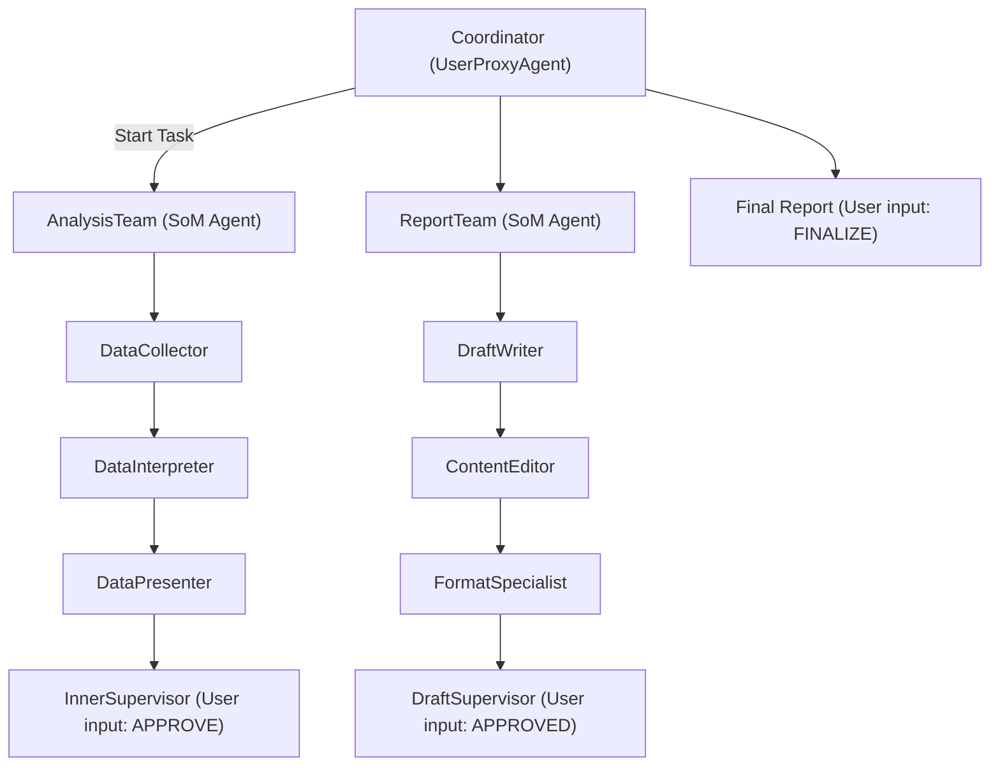
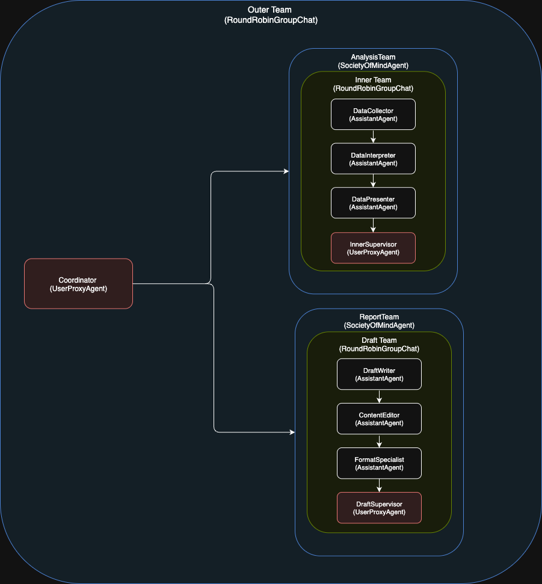

# 📊 Business Analysis & Executive Report Generator

This project implements a **multi-level AI agent system** using Microsoft [AutoGen](https://github.com/microsoft/autogen) to simulate enterprise workflows for data analysis, report generation, and human-in-the-loop supervision.

---

## 🚀 Features

- 🧠 Multi-agent architecture with role-specific agents
- 🔁 Team-based communication via `RoundRobinGroupChat`
- 👤 Human-in-the-loop using `UserProxyAgent`
- 💬 Streaming output via CLI interface
- 🔐 Secure secrets loading using `.env`
- 🧩 Modular design using `SocietyOfMindAgent` wrappers

---

## 🧠 System Architecture

### 🔹 Inner Team: `AnalysisTeam`

A specialized group of agents that analyze raw product and revenue data.

| Agent | Type | Responsibility |
|-------|------|----------------|
| `DataCollector` | AssistantAgent | Collects historical and market data |
| `DataInterpreter` | AssistantAgent | Analyzes trends and patterns in the data |
| `DataPresenter` | AssistantAgent | Summarizes findings into business insights |
| `InnerSupervisor` | UserProxyAgent | Human reviewer (CLI) who approves insights with `APPROVE` |

**Wrapped as:** `SocietyOfMindAgent(name="AnalysisTeam")`  
**Termination Signal:** `APPROVE` (from human)

---

### 🔹 Outer Team: `ReportTeam`

Uses the analysis to generate and polish an executive report.

| Agent | Type | Responsibility |
|-------|------|----------------|
| `DraftWriter` | AssistantAgent | Drafts report using insights from `AnalysisTeam` |
| `ContentEditor` | AssistantAgent | Refines the draft for tone, clarity, and grammar |
| `FormatSpecialist` | AssistantAgent | Formats the draft for business readability |
| `DraftSupervisor` | UserProxyAgent | Human reviewer (CLI) who approves with `APPROVED` |

**Wrapped as:** `SocietyOfMindAgent(name="ReportTeam")`  
**Termination Signal:** `APPROVED` (from human)

---

### 🔹 Orchestration Layer

Coordinates the entire workflow and manages both teams.

| Component | Type | Description |
|----------|------|-------------|
| `outer_team` | RoundRobinGroupChat | Combines `AnalysisTeam`, `ReportTeam`, and `Coordinator` |
| `Coordinator` | UserProxyAgent | CLI-based human who oversees the entire flow (`FINALIZE`) |

**Termination Signal:** `FINALIZE` (from human)

---

## 🧩 Flow Summary

---

## 🧠 Architecture Diagram

---

## 📄 Example Task

Evaluate Q2 business performance and generate an executive report with analysis and recommendations.
Data: Product A (1200 units, $12K), B (900 units, $8K), C (400 units, $4K).

---

## ✅ Sample Output
In Q2, Product A led in both units (1200) and revenue ($12K), followed by B and C. Product C underperformed. Recommend improving Product C’s market positioning and reviewing B’s pricing. Performance overall is stable.

---

## 🛠️ Setup Instructions

1. Clone the Repository
- git clone https://github.com/your-org/q2-report-agent.git

2. Install Dependencies
- pip install -r requirements.txt

3. Create a .env File
- AZURE_ENDPOINT=https://<your-endpoint>.openai.azure.com/
- API_KEY=<your-api-key>

---

## ▶️ Running the System
- streamlit run streamlit_app.py 

- You’ll see agent conversations streamed in the terminal.
- You’ll be asked for inputs like:

- APPROVE (to accept insights)

- APPROVED (to accept report draft)

- FINALIZE (to finish the session)

---

##  📁 Project Structure
<pre>
├── your_script.py           # Main script with agent setup and orchestration
├── config/
│   └── constants.py         # Model config
├── .env                     # Azure OpenAI credentials (not committed)
├── requirements.txt
└── README.md
</pre>

---

## ⚠️ Termination Keywords
- Signal	Sender	Purpose
- APPROVE	InnerSupervisor	Ends the inner analysis team loop
- APPROVED	DraftSupervisor	Ends the report draft team loop
- FINALIZE	Coordinator	Completes the entire process

---

##  👨‍💻 Author
- Dipanshu Porwal
- Senior AI Developer
- Multi-agent LLM Systems | AutoGen | Azure OpenAI | LangGraph

---

📬 Contact
- Have questions, ideas, or want to collaborate?
- Reach out and connect via Linkedin or email.
- Linkedin: https://www.linkedin.com/in/dipanshu-porwal-08317511b/
- E-mail: dipanshunitj@gmail.com

