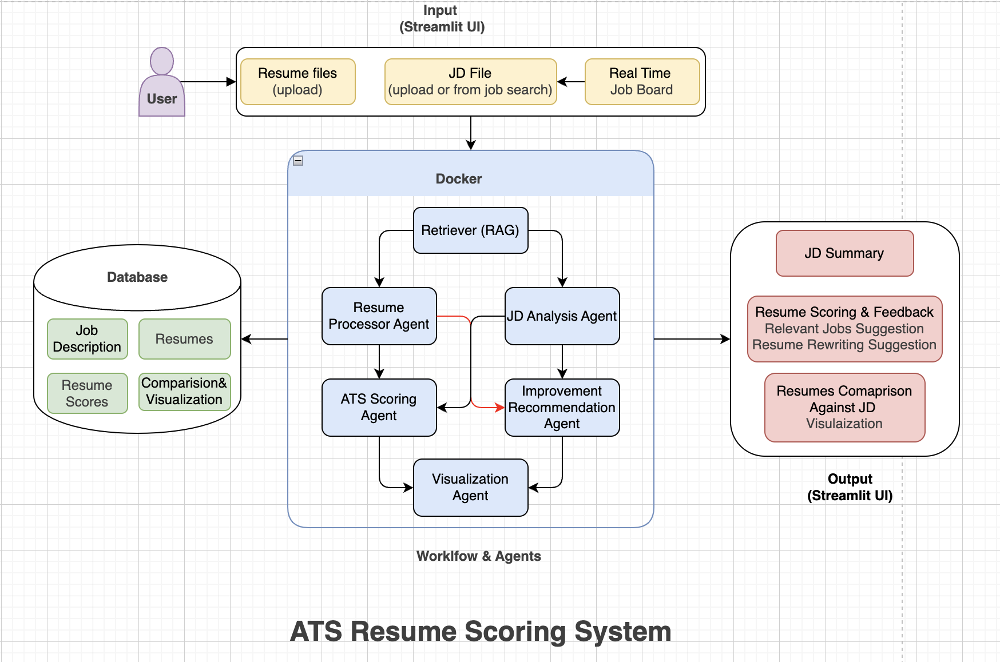

# 📄 ATS Resume Scoring & Improvement Suggestion App

An AI-powered, **RAG-augmented**, and **Docker-integrated** ATS Resume Scoring platform built with **Streamlit** and **async agent pipelines**.

---

## 🚀 Key Features

- ✅ Batch-process multiple resumes against a job description
- 🧠 AI agents for processing, scoring, recommending, and visualizing
- 🔁 Fully async pipeline
- 🧠 RAG-augmented JD understanding for better matching
- 📦 Docker integration for isolated execution
- 📊 Resume comparison via Radar, Pie, Donut, and Bar charts
- 🧭 Job suggestions based on resume content
- 📁 MongoDB support for persistence
- 💾 Downloadable score reports and recommendations

---

## 🚀 Feature Description

### 🧠 AI Agent Pipeline
The backend pipeline is composed of modular, asynchronous agents:
- **ResumeProcessorAgent**: Parses and extracts structured resume data.
- **JobDescriptionAnalysisAgent**: Extracts key criteria from job descriptions.
- **ATSScoringAgent**: Scores each resume based on relevance to the JD using RAG-based context.
- **ImprovementRecommendationAgent**: Suggests actionable changes for alignment.
- **VisualizationAgent**: Produces comparative visualizations across resumes.

### 🖥️ Streamlit UI
- Upload resumes and JDs directly.
- Or select job descriptions from a **live job board**.
- Interactive feedback, score summaries, radar/pie/bar/donut charts.
- Downloadable visual summaries and JD summaries.

---

## 🏗️ Project Structure
<pre>
├── agents/
│   ├── resume_processor.py                # Agent to parse and extract key information from resumes
│   ├── jd_analyzer.py                     # Agent to analyze job descriptions and extract structured data
│   ├── ats_scorer.py                      # Agent to compute ATS-based resume scoring
│   ├── improvement_suggester.py           # Agent to suggest improvements for resumes based on analysis
│   └── visualizer.py                      # Agent to generate visual representations of resume scoring
├── models/
│   └── azure_openai_client.py             # Azure OpenAI client wrapper to interact with LLMs
├── tools/
│   └── rag_retriever.py                   # Tool to perform context retrieval using RAG for better prompting
├── mongodb/
│   ├── mongo_seed.py                      # Script to seed initial data into MongoDB collections
│   └── mongo_writes.py                    # Utility to handle MongoDB insert/update operations
├── config/
│   ├── constants.py                       # Global constants and environment variable handlers
│   └── docker_util.py                     # Utilities to support Docker-specific configurations
├── rag/
│   └── rag_retriever.py                   # (Duplicate of tools/rag_retriever.py or used for internal module segregation)
├── prompts/
│   ├── sys_prompts/                       # System-level templates for prompting agents
│   │   ├── sys_ats_scoring_template.j2.py
│   │   ├── sys_improvement_recommendation_template.j2
│   │   ├── sys_jd_analysis_template.j2
│   │   ├── sys_resume_key_info_extarctor_template.j2
│   │   └── sys_visualization_template.j2
│   └── usr_prompts/                       # User-facing templates for personalized LLM interaction
│       ├── usr_ats_scoring_template.j2.py
│       ├── usr_improvement_recommendation_template.j2
│       ├── usr_jd_analysis_template.j2
│       ├── usr_resume_key_info_extarctor_template.j2
│       └── usr_visualization_template.j2
├── schemas/
│   ├── ats_schema.py                     # Schema for ATS scoring results
│   ├── improvement_schema.py             # Schema for resume improvement suggestions
│   ├── job_description_schema.py         # Schema for structured job descriptions
│   ├── resume_schema.py                  # Schema for parsed resume content
│   └── visualization_schema.py           # Schema for chart and visual output data                     
├── ui/
│   ├── sidebar.py                         # Sidebar UI logic for Streamlit app
│   ├── job_board.py                       # Renders interactive job listings UI
│   ├── jd_summary.py                      # Displays summary of job descriptions
│   ├── resume_summary.py                  # Displays extracted resume insights
│   ├── visualization.py                   # Renders visual score and comparison charts
│   └── styles.css                         # Custom styling for Streamlit UI
├── services/
│   └── job_fetcher.py                     # Service to fetch jobs (from APIs or mock data)
├── utils/
│   ├── file_io.py                         # Utility functions for reading and writing files
│   ├── constants.py                       # Project-wide constants reused across modules
│   ├── file_parser.py                     # File parsing logic for resumes and JDs
│   ├── prompt_loader.py                   # Loads and renders prompt templates dynamically
│   └── report_generator.css               # Optional CSS styling for exported reports
├── input/
│   ├── test_resume/                       # Folder for storing sample resumes for testing
│   └── test_jd/                           # Folder for storing sample job descriptions for testing
├── output/
│   ├── resumes/                           # Processed resume outputs
│   ├── jds/                               # Processed job description outputs
│   ├── scores/                            # Scoring results stored for each resume
│   ├── recommendations/                   # Improvement suggestions generated for resumes
│   └── visualizations/                    # Charts and score visualizations
├── pipeline/
│   └── runner.py                          # Orchestration script to run the full ATS scoring pipeline
├── streamlit_app.py                       # Entry point for the Streamlit-based frontend
├── main.py                                # Main script for running CLI or backend services
├── requirements.txt                       # Python dependencies
├── .gitignore                             # Files and folders to exclude from Git tracking
├── .env.example                           # Example environment variable file for setup
└── README.md                              # Project documentation (you're reading it!)
</pre>

---

## 🧠 System Architecture

---

## ⚙️ Setup Instructions

### 1. Clone the repository

git clone https://github.com/yourusername/ats-resume-scoring-app.git
cd ats-resume-scoring-app

### 2. Install dependencies

pip install -r requirements.txt

**Ensure you have Python 3.9+ installed.**

### 3. Run the MongoDB server

mongod --port 27020 --dbpath ~/mongo-data

### 4. Start the Streamlit app

streamlit run streamlit_app.py

---

## 🧪 How It Works
### 🧩 The Pipeline Workflow:
- Upload Resumes & JD via sidebar or use job board.

- Process Resumes & JD using runner.py async pipeline.

- Score resumes via ATSScoringAgent using RAG context.

- Recommend improvements using reasoning-based analysis.

- Visualize results with side-by-side comparison.

- Store everything in MongoDB and local folders.

- Suggest job listings based on extracted skills.

---

### 🛠️ Developer Notes
- All agents are modular and async.

- Uses MongoDB for persistence (save_resume_data, save_jd_data, etc.).

- RAG context injected using get_augmented_context(...).

- Rich charts (Pie, Radar, Bar, Heatmap, Donut) rendered via Plotly.

- Downloadable results and summaries.

- Clean Streamlit UI with custom CSS.

---

### 💾 Output Structure
- output/resumes/: Extracted structured resume data

- output/jds/: Parsed JD data

- output/scores/: ATS score JSON files

- output/recommendations/: Suggestions per resume

- output/visualizations/: Generated chart JSON data

- output/combined_data.json: Combined result summary

---

## 🧪 Tech Stack

| Library / Tool                        | Purpose                                                                 |
|--------------------------------------|-------------------------------------------------------------------------|
| **Python 3.9+**                      | Core language for the entire system                                     |
| **Streamlit**                        | Web UI framework for interactive apps                                  |
| **LangChain / RAG**                  | Retrieval-Augmented Generation for context-aware JD analysis            |
| **Docker**                           | Isolated and portable containerized execution                          |
| **MongoDB**                          | Resume and scoring data persistence                                     |
| **Asyncio**                          | Enables concurrent execution of agents                                 |
| **Plotly**                           | Interactive and animated charting for web-based visualizations          |
| **Matplotlib**                       | Static chart rendering, fallback for plotting                          |
| **dotenv**                           | Loads environment variables from `.env` files securely                 |
| **pymongo**                          | Python client for interacting with MongoDB                             |
| **chardet**                          | Automatically detects character encodings in input files               |
| **faiss-cpu**                        | High-speed vector similarity search (used for semantic search in RAG)  |
| **pdfplumber**                       | Extracts clean text from PDF resumes                                   |
| **python-docx**                      | Parses Word (.docx) resume files                                       |
| **nest_asyncio**                     | Allows nested asyncio event loops (important for Streamlit compatibility) |
| **sentence_transformers**            | Embedding model for semantic similarity and RAG                        |
| **autogen-agentchat**               | Core AutoGen framework for agent-based conversation orchestration       |
| **autogen-agentchat[models]**       | Includes support for LLM model configuration and API integration       |
| **autogen-ext**                      | Extensions for AutoGen (adds external tool support, integrations)       |
| **autogen-ext[docker]**              | Enables Docker support for agent execution in sandboxed environments    |
| **autogen-ext[openai,azure]**        | Adds OpenAI and Azure OpenAI provider support                          |
| **pydantic[email]**                  | Pydantic models with email type validation (used in profile/contact handling) |

---

### 👨‍💻 Author
- Dipanshu Porwal
- Senior AI Developer
- 📫 Connect via GitHub or LinkedIn

